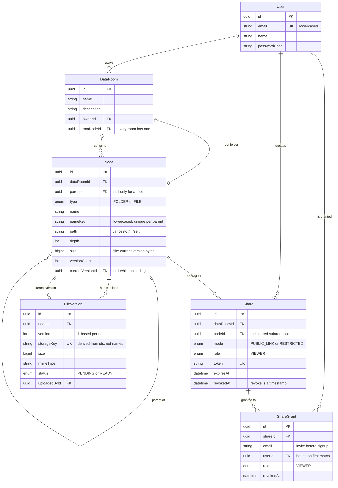

# Data Room

A virtual data room: an organised, private repository for the documents behind a
deal, with folders, PDF uploads, and sharing that can be handed to one person or
to anyone with a link.

| | |
| --- | --- |
| **Web** | https://data-room-iota-one.vercel.app |
| **API** | `<render-url>` — health check at `/api/health` |
| **Stack** | Next.js · NestJS · PostgreSQL · Prisma · Supabase Storage |

---

## What it does

**Folders** — create and nest them, browse with breadcrumbs, rename, and delete.
Deleting tells you exactly what will go, counted server-side, before you confirm.

**Files** — drag and drop several PDFs at once with real per-file progress,
cancel or retry any of them, view them in the browser, rename, move, download,
and delete. Uploading a name that already exists asks whether to keep both or
add a new version.

**Sharing** — share a data room, a folder, or a single file. Either mode gives
read-only access to that item and everything under it: a **public link** anyone
can open, or a **restricted** share limited to the people you name. The owner can
revoke either at any time.

**Search** — find files and folders by name anywhere in a data room, or, for
someone browsing a share, anywhere inside what was shared with them.

---

## Running it locally

Requires Node 20+, pnpm 10+, and a Supabase project (free tier is enough).

```bash
git clone https://github.com/Conversee12/data-room.git
cd data-room
pnpm install
cp .env.example .env
```

Fill in `.env` from your Supabase project:

| Variable | Where it comes from |
| --- | --- |
| `DATABASE_URL` | Connect → Transaction pooler (port 6543), keep `?pgbouncer=true` |
| `DIRECT_URL` | Connect → Session pooler (port 5432); migrations cannot run through the transaction pooler |
| `SUPABASE_URL` | Project Settings → API → Project URL |
| `SUPABASE_SERVICE_ROLE_KEY` | Project Settings → API → `service_role` |
| `SUPABASE_STORAGE_BUCKET` | Name of a **private** bucket you create in Storage |
| `JWT_SECRET` | Any long random string — `openssl rand -base64 48` |

Then create the schema and start both apps:

```bash
pnpm db:migrate
pnpm dev
```

The web app runs on <http://localhost:3000> and the API on <http://localhost:4000>.

### Checking it works

```bash
pnpm --filter @data-room/api smoke
```

Fifty-odd assertions against a running API, its real database and real storage —
including an upload that actually transfers bytes, a folder move that has to drag
its whole subtree with it, and a share that must reach nested files while
stopping at the edge of its subtree. Point it elsewhere with
`API_URL=https://… pnpm --filter @data-room/api smoke`.

### Layout

```text
apps/api/        NestJS: auth, tree, uploads, sharing
apps/web/        Next.js App Router
packages/db/     Prisma schema and migrations
packages/shared/ Types, zod schemas and naming rules used by both sides
```

---

## Design decisions

### One table for the whole hierarchy

Folders and files are rows in the same `nodes` table, separated by a `type`
column. The alternative — a `folders` table and a `files` table — duplicates
every tree operation, and each duplicate is a chance for the two to disagree.
With one table, listing, breadcrumbs, subtree totals, move, cascade delete and
share scoping each have exactly one implementation.

### A materialized path, not a recursive walk

Every node stores the ids of its ancestors and itself as a string:

```text
root                    /a/
root > Legal            /a/b/
root > Legal > nda.pdf  /a/b/c/
```

The leading and trailing slashes matter: `child.path` starts with `parent.path`
only for genuine descendants, so a prefix comparison can never match a node whose
id merely begins with the same characters.

This turns "everything under X" into an indexed prefix scan rather than a
recursive CTE. Ancestors come out of the string itself, so breadcrumbs and
"which shares cover this node" need no tree traversal at all. Moving a folder
rewrites its subtree's paths in one `UPDATE`, so moving ten thousand documents is
a single round trip that cannot leave descendants pointing at the old location.

The cost is that a move touches every descendant row. That is the right trade
here: reads and share checks happen constantly, moves rarely.

### Sharing is one rule at three depths

A share points at a node. Sharing a data room is sharing its root folder — which
is why every data room owns a root node from the moment it is created. A share
covers a node when the shared node **is** that node or one of its ancestors, and
the ancestors are already in the path, so the check is an `IN` over a handful of
ids.

The consequence is that a data room share, a folder share and a single-file share
are the same code. Every read goes through one resolver that answers "may this
caller see this node, and with what rights" for owners, public links and named
grants alike. There is no second, weaker path that a future feature could forget
to guard.

### Uploads never pass through the API

The browser asks the API for permission, PUTs the bytes straight to storage on a
short-lived signed URL, then tells the API to publish the version.

That is what makes genuine per-file progress possible — `fetch` cannot report
upload progress, so the transfer uses `XMLHttpRequest` — and it means a 50 MB
document never occupies an API process. Reads work the same way: the bucket is
private and every view is a fresh signed URL.

Publishing is a separate step because it is the only way to know the bytes really
arrived. The size written to the node is the one storage reports, not the one the
client claimed, so folder totals cannot be poisoned by a lying client. An
abandoned upload leaves a pending row that is invisible in listings but still
holds its name, so a retry keeps it.

### Name conflicts are settled by the database

A partial unique index on `(parentId, nameKey)` rejects duplicates, where
`nameKey` is the lowercased name — so `Contract.pdf` and `contract.pdf` collide,
which is what people expect. Checking first and inserting afterwards would let
two concurrent uploads both pass the check.

The API turns that violation into a message about the name the user typed, and an
auto-renaming upload retries with the next free number.

### Errors carry codes, not just prose

Every deliberate failure has a stable code — `NAME_CONFLICT`, `SHARE_REVOKED`,
`UPLOAD_INCOMPLETE`. The UI branches on the code, so a revoked link gets its own
screen and a clash reopens the rename prompt, and the wording can change without
breaking behaviour.

### Authentication

Email and password, with bcrypt. The token is a JWT sent in an `Authorization`
header and kept in `localStorage`.

A cookie would be better, but the API is on a different origin from the app,
where a cookie has to be third-party — blocked by default in several browsers.
The honest trade-off is that a token in `localStorage` is readable by injected
script. The production answer is to serve both from one origin, at which point
the token moves to a `Secure; HttpOnly; SameSite=Lax` cookie with no other
changes.

---

## Data model



Two details worth calling out.

`size` and `versionCount` are denormalized onto `Node` on purpose. A folder's
total is then a `SUM` over the prefix scan that never touches `file_versions`,
and a listing does not run a subquery per row.

Revoking a share sets `revokedAt` rather than deleting the row. Someone who
follows the link afterwards is told it was turned off, which is more useful than
a 404, and the owner keeps a record that the link existed.

---

## How it scales

### Computing a folder's total size and item count

One query, no recursion:

```sql
SELECT count(*) FILTER (WHERE type = 'FILE' AND "currentVersionId" IS NOT NULL),
       count(*) FILTER (WHERE type = 'FOLDER'),
       coalesce(sum(size), 0)
FROM   nodes
WHERE  "dataRoomId" = $1
  AND  path LIKE $2 || '%'
  AND  id <> $3;
```

It is served by an index that has to be declared carefully:

```sql
CREATE INDEX ON nodes ("dataRoomId", path text_pattern_ops);
```

`text_pattern_ops` is load-bearing. Under the database's default collation a
plain btree cannot answer `path LIKE '/a/b/%'`, because collation ordering is not
character-by-character; the pattern operator class compares the way a prefix
match needs.

Because file sizes are denormalized onto the node rows, this reads one table and
touches only the subtree. It is computed on demand — when a delete confirmation
needs to say what will disappear — rather than kept up to date on every write.

At the point where a data room holds millions of nodes and totals are wanted on
every screen, the next step is a counter cache on each folder, updated in the
same transaction as the write and repaired by a periodic reconciliation job.
Nothing in the schema has to change for that.

### One data room with 100,000 files

**Listing** never loads a data room; it loads one folder. `(parentId, type, name)`
covers the query and the sort, so a folder with a thousand children is the same
cost whether the room holds a hundred files or a hundred thousand.

**Pagination** is keyset, not offset. The API returns an opaque cursor and the
next page continues from the last row, so page 500 costs what page 1 costs —
`OFFSET 25000` would make the database walk 25,000 rows to discard them.

**Search** is a substring match on names, which no btree can serve. A trigram
index keeps it an index scan:

```sql
CREATE EXTENSION pg_trgm;
CREATE INDEX ON nodes USING gin ("nameKey" gin_trgm_ops);
```

Beyond names — searching document contents — the answer is a separate index
(Postgres full-text or a dedicated search service) fed asynchronously, because
extracting text from a PDF does not belong in an upload request.

**Uploads** already scale sideways: bytes go browser-to-storage, so a hundred
concurrent uploads cost the API a hundred cheap metadata writes, not a hundred
streams.

**What would strain first** is a move at the top of a very deep tree, since it
rewrites every descendant's path. At a hundred thousand nodes that is one
`UPDATE` over the subtree — fine, but it is the operation to watch, and the
mitigation is to run it in a background job that reports progress rather than
holding an HTTP request open.

### Extending sharing to per-user roles

The column is already there. `Share.role` and `ShareGrant.role` are a `ShareRole`
enum that currently has one value, `VIEWER`, and the resolver already returns a
role rather than a boolean:

```ts
{ role: 'VIEWER', canWrite: false, canShare: false, scopeNodeId: … }
```

Adding an editor is a value added to the enum plus a rule in one function:
`canWrite` becomes true for `EDITOR`. Every write path already asks
`requireWrite`, so nothing else moves. Per-grant roles are supported too — the
role lives on `ShareGrant`, not only on `Share`, so one link can carry a viewer
and an editor.

The deliberate omission is a role *hierarchy*. If roles ever need to be inherited
and overridden — editor on a folder, viewer on one file inside it — the resolver
would collect every covering share instead of the first, and take the strongest.
That is a change to one function because access resolution was kept in one place.

---

## Where AI was used

The whole project was built in a working session with Claude (Claude Code). What
that looked like in practice:

**Written by AI, reviewed by me** — nearly all of the code. The parts I directed
rather than accepted were the ones that decide how the system behaves: the single
`nodes` table, the materialized path and its trailing-slash convention, making a
data room's root a real node so shares have one target type, splitting uploads
into intent and publish, and enforcing name uniqueness in the database instead of
in application code.

**Where AI caught real problems.** The end-to-end check was written before the
frontend and found two defects that unit tests would have missed. Moving anything
failed with a 500, because Prisma sends numeric parameters as `bigint` and
`substring(text, bigint)` does not exist in Postgres — so the statement that
rewrites a moved subtree's paths never ran. Separately, the API was building into
a half-empty `dist`: Nest clears the output directory while the incremental
compiler skips files it believes are already emitted. That one would have failed
the same way on the first deploy.

**Where I overrode it.** The first upload implementation resolved name clashes
silently. Silently renaming someone's document is the kind of thing that erodes
trust in a tool holding legal papers, so the batch now asks once, up front, and
"keep both" and "new version" both preserve the original bytes.

**Not AI.** Deciding what to build and in what order, the UX judgements above,
and verifying the result by driving the deployed app rather than trusting that
the code looked right.

---

## Known limitations

Honest about what an MVP leaves out:

- **Deleting is permanent.** No trash, no restore. Soft deletion would be a
  `deletedAt` column and a filter on every read — cheap to add, but a delete that
  looks recoverable and is not would be worse than one that warns.
- **Storage cleanup is best effort.** Rows are deleted in a transaction; blobs
  are removed afterwards and failures are logged. An orphaned object costs
  storage; an orphaned row costs the user a document that will not open.
- **Abandoned uploads are not swept.** A pending version that never completes
  holds its name until it is retried or cancelled. Production wants a job that
  clears them after a few hours.
- **The token is in `localStorage`.** Explained under Design decisions, with the
  path off it.
- **Only PDFs.** The limit is enforced in the schema, at the API, and by the
  storage bucket. Widening it is a constant, not a rewrite.
- **The API sleeps.** On Render's free tier the service idles after inactivity,
  so the first request after a quiet spell takes about a minute. The UI shows a
  loading state rather than an error.
